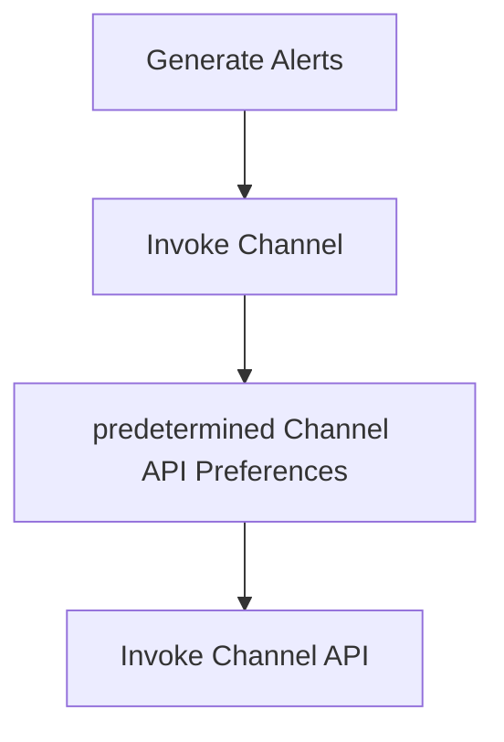

## Requirement

There is a need for various notification channels behave generic over the parameters get receive. The Parameters could be the API Endpoints, Authentication mechanism the API use and their payload structure. For ex: Microsoft Teams can be configured in few different ways in an environment:
1. Directly invoke the Microsoft Teams public API with the already documented approach.
2. Invoke a Third Party Team Reverse Proxy with details specific to the third party.
3. May be another Microsoft Teams compliant API with different Authentication mechanism

Considering all the above, we need a solution that works for all of them and is generic and extensible. This definitely calls for dynamic and configurable channel settings. Users must be able to specify how *their* channel APIs are to be invoked. These specifications must have static mapping like hard coded values to be included in the payload of the Channel's API calls, specific Authentication mechanism to use like `Basic Username Password Auth` `Cookie` or `Token`  and dynamic mapping like what fields from the alert to be included in the payload and under what keys and structure etc.

## Current Flow

## Proposed Changes

### Whats App
- Have the following fields in the preference settings.
	-  `WhatsApp API Type` : This says what all types of `WhatsApp` vendors we support. Possible values are:
		- `None`
		-  `WhatsApp API Type`, then we will need the below details to Invoke the endpoint:
			- `PhoneNo. ID`
			- `Access Token`
			- `template_details` (A list of templates with names)
		- `Custom` API Type, then we will need:
			- `API Endpoint`
			- `Auth type`
				- `Basic` (requires `username` and `password`)
				- `Token` (requires token)
				- `Cookie` (requires cookie)
				- `OAuth 2.0` (requires details like client URL, client secret,  token URL and so on)
			- `template_details`
			- `Advanced Configuration`
			- `Configuration Script`
### Teams
- Have the following fields in the preference settings.
	-  `Teams Configuration Mode` : This says what all types of `Teams` vendors we support. Possible values are:
		- `None`
		-  `Standard Configuration`, then we will need the below details to Invoke the endpoint:
			- `ChannelsURLS` (A dict of templates with names)
		- `Custom` API Type, then we will need:
			- `API Endpoint`
			- `Auth type`
				- `Basic` (requires `username` and `password`)
				- `Token` (requires token)
				- `Cookie` (requires cookie)
				- `OAuth 2.0` (requires details like client URL, client secret,  token URL and so on)
			- `ChannelsURLS`
			- `Advanced Configuration`
			- `Configuration Script`

### Notes
From the above it is clear that now we need to support a `Custom` API Configuration Type for both `WhatsApp` and `Team`. The format of `Custom` is almost of the same for both `WhatsApp` and  `Teams` except the inclusion of their own specific `Standard Configuration` . So, in case of `Custom` Type, a common Proxy Layer is required that prepares the `HTTP` requests before being fired. 

### Custom Type

- Determine the API Endpoint and the `HTTP` verb to use
- Prepare the `HTTP` header including the `Auth` related headers
- Prepare the Payload to be sent in the `API`  request.
	- Use `Advanced Configuration`  to prepare the body
	- Use `Configuration Script` to prepare the body
- Fire the API request and return response

## Notification Generation Flow

- Receive a bunch of `alerts`, `tenant_id` and `template` using which the notification has to be generated.
- Fetch `WhatsApp` preference for the `tenant_id` given, from `DB` or `Cache`. The preference data includes:
	- API configuration `Standard` or `Custom` and its API details
	- Possible Templates to be used for the given `tenant_id`
- Match the given `template`  with all the ones available in the preferences. If none is found use the first one found in the preference else use the details of the matched one from preference for notification generation